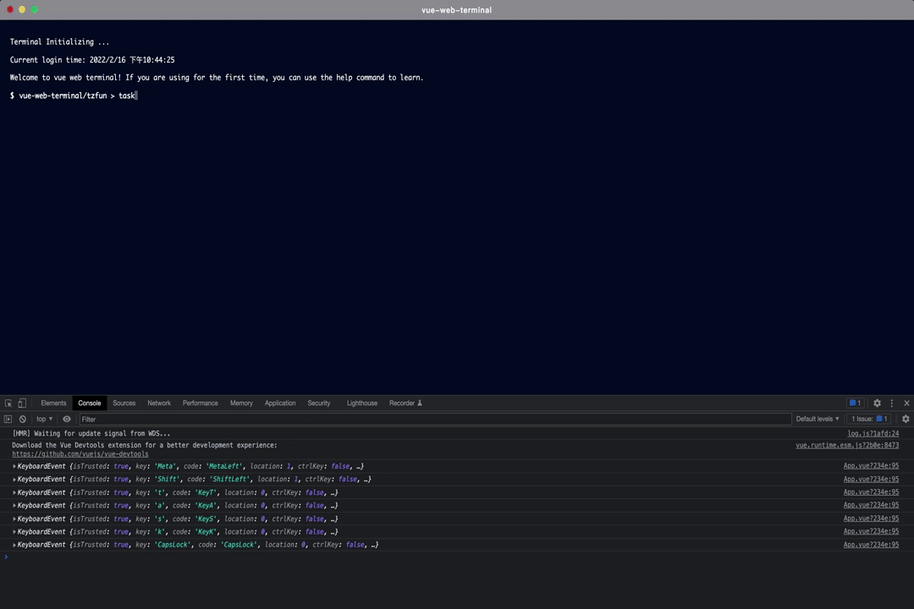
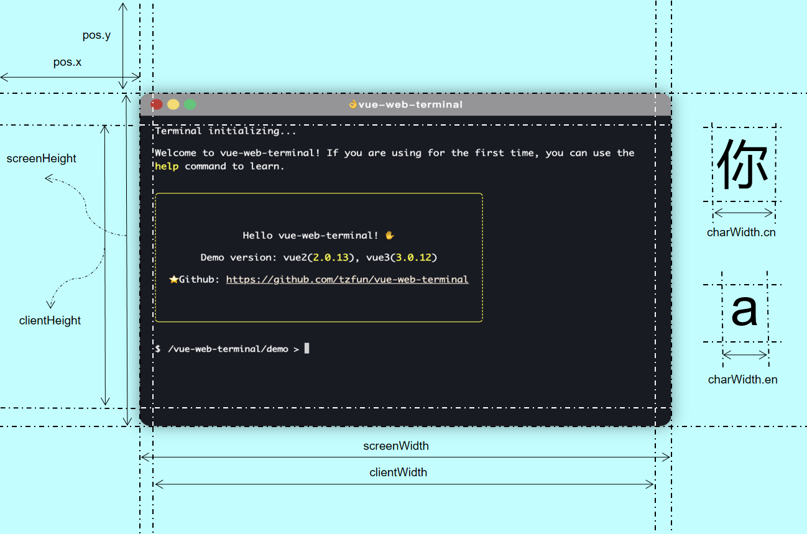
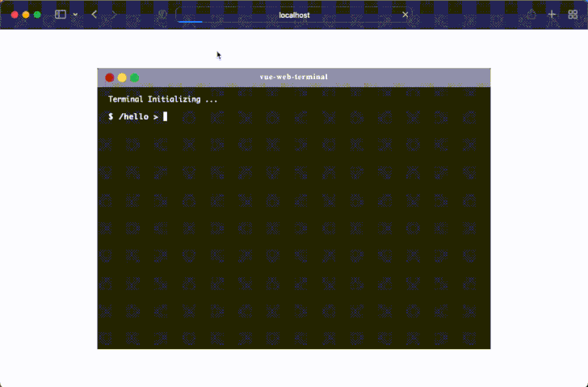

[中文版](./README_ZH.md) | English

<div align=center>

</div>

# vue-web-terminal

<a href="https://github.com/tzfun/vue-web-terminal/tree/vue2"></a>
<a href="https://github.com/tzfun/vue-web-terminal/tree/vue3"></a>
<a href="https://www.npmjs.com/package/vue-web-terminal"></a>
<a href="https://npmcharts.com/compare/vue-web-terminal?minimal=true"></a>
<a href="https://www.npmjs.com/package/vue-web-terminal"></a>

A web-side command line plugin built by `Vue`, supports multiple message formats such as tables, json, and codes, supports custom message styles, command line libraries, typing search prompts, etc., and simulates native terminal support ← → cursor toggle and ↑ ↓ history command toggle.

## Feature Support

* Supported message formats: `text`, `table`, `json`, `code/multiline text`, `html`, `ansi`
* Support [Flash](#Flash) real-time echo
* Support user input.(For example, enter username and password to log in)
* Support `Highlight.js`, `Codemirror.js` code highlighting
* Support ← → key cursor switch
* Support ↑ ↓ key history command toggle
* Support full-screen display
* Support window drag
* Support for multi-line text editing
* Support custom command library and search for help tips, use the `Tab` key to quickly fill
* Support user inputting filter
* Support API interface: execute command, push message, simulate drag and drop, execute, full screen, etc.
* Provides multiple slots to support custom styles



> Short description:
>
> It does not have the ability to execute a specific command. This ability needs to be implemented by the developer.
> What it is responsible for is to get the command to be executed from the user in the form of an interface, and then
> hand it over to the developer to implement and execute. After that, hand it over to show it to the user

# Online Experience

Demo：[https://tzfun.github.io/vue-web-terminal/](https://tzfun.github.io/vue-web-terminal/)

[](https://codesandbox.io/s/silly-scooby-l8wk9b)

# Quick Start

Install vue-web-terminal by npm. The `2.x.x` version corresponds to vue2, and the `3.x.x` version corresponds to vue3.
It is recommended to download the latest version corresponding to the main version.

```shell
#  install for vue2
npm install vue-web-terminal@2.xx --save

#  install for vue3
npm install vue-web-terminal@3.xx --save 
```

Use Terminal plugin in `main.js`

```js
import Terminal from 'vue-web-terminal'
// This style needs to be introduced in versions after 3.2.0 and 2.1.13. 
// There is no need to introduce theme styles in previous versions.
import 'vue-web-terminal/lib/theme/dark.css'

// for vue2
Vue.use(Terminal)

// for vue3
const app = createApp(App).use(Terminal)
```

Example:

```vue
<template>
  <div id="app">
    <terminal name="my-terminal" @exec-cmd="onExecCmd"></terminal>
  </div>
</template>

<script>
import Terminal from "vue-web-terminal"
// This style needs to be introduced in versions after 3.2.0 and 2.1.13. 
// There is no need to introduce theme styles in previous versions.
import 'vue-web-terminal/lib/theme/dark.css'

export default {
  name: 'App',
  components: {Terminal},
  methods: {
    onExecCmd(key, command, success, failed) {
      if (key === 'fail') {
        failed('Something wrong!!!')
      } else {
        let allClass = ['success', 'error', 'system', 'info', 'warning'];

        let clazz = allClass[Math.floor(Math.random() * allClass.length)];
        success({
          type: 'normal',
          class: clazz,
          tag: '成功',
          content: command
        })
      }
    }
  }
}
</script>

<style>
body, html, #app {
  margin: 0;
  padding: 0;
  width: 100%;
  height: 100%;
}
</style>
```

# Document

## Theme

Starting from `2.1.13` and `3.2.0` versions, the plugin has two built-in themes: `dark` and `lignt`

```js
//  import dark theme
import 'vue-web-terminal/lib/theme/dark.css'

//  import light theme
import 'vue-web-terminal/lib/theme/light.css'
```

If you need to customize the theme, you can customize the corresponding css variables.

> Note: Versions before `2.1.12` and `3.1.8` (including) do not support the theme function,
> and there is no need to introduce css files.

## Attributes

Terminal tag supports attribute parameter table.

| Argument               | Description                                                                                                                                                                                                     | Type     | Default                                          |
|------------------------|-----------------------------------------------------------------------------------------------------------------------------------------------------------------------------------------------------------------|----------|--------------------------------------------------|
| name                   | Terminal instance name, the name of the same vue instance must be unique, this value is also used in API.                                                                                                       | string   | terminal                                         |
| context                | Context text.                                                                                                                                                                                                   | string   | /vue-web-terminal                                |
| context-suffix         | Context text suffix.                                                                                                                                                                                            | string   | \>                                               |
| title                  | The title displayed in the header.                                                                                                                                                                              | string   | vue-web-terminal                                 |
| show-header            | Whether to display the header, this switch will affect the drag and [drop](#Drag) function. Only when the header is displayed can the drag and drop function provided by default be used.                       | boolean  | true                                             |
| init-log               | The log displayed when Terminal is initialized. It is an array composed of [Message](#Message), `null` is not displayed.                                                                                        | array    | /                                                |
| auto-help              | Whether to enable the command line automatic search prompt function.                                                                                                                                            | boolean  | true                                             |
| enable-example-hint    | Whether to show sample prompts, provided that `auto-help` is enabled.                                                                                                                                           | boolean  | true                                             |
| command-store          | Customized command library, the search prompt function will scan this library, see [Command Definition](#Command)                                                                                               | array    | [Local Commands](#Local)                         |
| command-store-sort     | Command line library sorting function, the display collation of the custom command library.                                                                                                                     | function | function(a,b)                                    |
| input-filter           | Custom input filter, the return value is the filtered string, must be plain text, no html tags.                                                                                                                 | function | function(当前输入字符char, 输入框内字符串value, input事件event) |
| drag-conf              | Drag and drop window configuration items. **If you do not configure it, the parent element will be filled with 100%, and the window width and height are equal to the width and height of the parent element.** | object   | [Drag](#Drag)                                    |
| command-formatter      | Command display formatting function, pass in the current command and return a new command, support html. If not set, the internally defined highlight style will be used.                                       | function | function(cmd)                                    |
| tab-key-handler        | The logic processing method when the user types the Tab key can be used in conjunction with the `helpCmd` slot.                                                                                                 | function | function(event, rewriteCallback(newCmd))         |
| search-handler         | User-defined command search prompt implementation, the callback needs to resolve a command object, the specific format see [Command Definition format](#Command), can be used with `helpCmd` this slot          | function | function(commandStore, key, callback)            |
| scroll-mode            | Scroll bar mode.                                                                                                                                                                                                | string   | smooth                                           |
| push-message-before    | A hook function that fires before the push message is displayed.                                                                                                                                                | function | function(message, name)                          |
| log-size-limit         | Limit the maximum number of displayed logs.                                                                                                                                                                     | number   | 200                                              |
| enable-default-command | Enable default command handler.                                                                                                                                                                                 | boolean  | true                                             |

## Events

Terminal tag support event table

| Event name      | Description                                                                                                                                                                                                                                                         | Callback arguments                         |
|-----------------|---------------------------------------------------------------------------------------------------------------------------------------------------------------------------------------------------------------------------------------------------------------------|--------------------------------------------|
| exec-cmd        | Fired when a custom command is executed. `success` and `failed` are callback functions, **must call one of the two callbacks before echoing**! the meaning of the `success` callback parameter is described below, and the `failed` callback parameter is a string. | `(cmdKey, command, success, failed, name)` |
| before-exec-cmd | Triggered before the user presses Enter to execute the command.                                                                                                                                                                                                     | `(cmdKey, command, name)`                  |
| on-keydown      | When the cursor focus is obtained, press any keyboard to trigger.                                                                                                                                                                                                   | `(event, name)`                            |
| on-click        | Triggered when the user clicks the button, the parameter `key` is the unique identification of the button, there are buttons: `close`, `minScreen`, `fullScreen`, `title`, `pin`.                                                                                   | `(key, name)`                              |
| init-before     | Lifecycle function, triggered before plugin initialization.                                                                                                                                                                                                         | `(name)`                                   |
| init-complete   | Lifecycle function, triggered after plugin initialization is complete.                                                                                                                                                                                              | `(name)`                                   |
| on-active       | Triggered when the window is active.                                                                                                                                                                                                                                | `(name)`                                   |
| on-inactive     | Triggered when the window is inactive.                                                                                                                                                                                                                              | `(name)`                                   |

**Special note**: The `success` callback parameter of `exec-cmd` supports multiple data types, and the execution logic of different data types will be different:

* If no parameters are passed, the execution will end immediately
* Passing in a [Message](#Message) will append a message to the record and end the execution immediately
* Pass in a [Message](#Message) array, which will append multiple messages to the record and end the execution immediately
* Pass in a `TerminalFlash` object, it will enter the processing logic of [Real-time-echo(Flash)](#Flash), this execution will not end until `finish()` is called
* Pass in a `TerminalAsk` object, it will enter the processing logic of [user-input](#User-input), this execution will not end until `finish()` is called

> PS:
>
> Starting from `2.1.7` and `3.1.3` versions, the camel case naming of events has been removed. If your version is later, please use a dash name, such as `@exec-cmd="onExecCmd"`.
> [issue#41](https://github.com/tzfun/vue-web-terminal/issues/41)


## Slots

Terminal supports the following custom slots, this feature is supported in `2.0.11` and `3.0.8` versions and later.

| Slot name    | Arguments            | Description                                                                                               |
|--------------|----------------------|-----------------------------------------------------------------------------------------------------------|
| header       | /                    | Customize the header style, still retain the drag area.                                                   |
| helpBox      | { showHeader, item } | Custom command search result prompt box, item is the search result.                                       |
| normal       | { message }          | Custom `normal` type message.                                                                             |
| json         | { message }          | Custom `json` type message.                                                                               |
| table        | { message }          | Custom `table` type message.                                                                              |
| code         | { message }          | Custom `code` type message.                                                                               |
| html         | { message }          | Custom `html` type message.                                                                               |
| flash        | { content }          | Custom flash style.                                                                                       |
| helpCmd      | { item }             | Custom command search prompt style.                                                                       |
| textEditor   | { data }             | Custom text editor style. For more information on how to use text editors, see [Text Editor](#TextEditor) |

example:

```vue
<terminal :name="name" @exec-cmd="onExecCmd">
  <template #header>
    This is my custom header
  </template>
  
  <template #json="data">
    {{ data.message }}
  </template>
  
  <template #helpBox="{showHeader, item}">
    {{ item }}
  </template>
  
  <template #textEditor="{data}">
        <textarea name="editor" class="t-text-editor" v-model="data.value"
                  @focus="data.onFocus" @blur="data.onBlur"></textarea>
    <div class="t-text-editor-floor" align="center">
      <button class="t-text-editor-floor-btn" @click="_textEditorClose(false)">Cancel</button>
      <button class="t-text-editor-floor-btn" @click="_textEditorClose(true)">Save & Close(Ctrl + S)</button>
    </div>
  </template>
</terminal>
```

## API

This plugin provides some API that can use javascript to actively initiate event requests to the plugin. You have two ways to call the API:

1). **Get the global API object**

PS: **Global API interface calls need to use the `name` of Terminal.**

```js
import {TerminalApi} from "vue-web-terminal"

//  invoke api
TerminalApi.pushMessage('my-terminal', 'hello world!')
```

2). **Get the instance call API**

This method calls all API interfaces without passing in the name
```js
//  vue template code
<terminal ref='myTerminalRef'></terminal>

//  ......

//  vue2 js code
this.$refs.myTerminalRef.pushMessage('hello world!')

//  vue3 js code
const myTerminalRef = ref()
myTerminalRef.pushMessage('hello world!')
```

### pushMessage()

[Online Demo](https://tzfun.github.io/vue-web-terminal/?cmd=loop)

Push one or more messages to Terminal.

```js
//  Each terminal will define a name, see the previous document for details
let name = 'my-terminal'

// push a message
let message = {
  class: 'warning',
  content: 'This is a wanning message.'
}

TerminalApi.pushMessage(name, message)

// push multiple messages
let messages = [
  {content: "message 1"},
  {content: "message 2"},
  {content: "message 3"}
]
TerminalApi.pushMessage(name, messages)
```

### appendMessage()

> Newly added in version `3.2.0`

Append content to the last message. It will be appended only if the last message exists and its type is normal, ansi, code, html, otherwise push a new message.

```js
TerminalApi.appendMessage('my-terminal', "this is append content")
```

### fullscreen()

Make the current terminal enter or exit full screen.

```js
TerminalApi.fullscreen('my-terminal')
```

### isFullscreen()

Determine if the current state is full screen.

```js
//  true or false
let fullscreen = TerminalApi.isFullscreen('my-terminal')
```

### dragging()

When [Feature Drag](#Drag) is enabled, you can use the following method to simulate drag to change the window position, where the parameter `x` is the distance from the left border of the terminal to the left border of the browser's visible range, `y ` is the distance from the upper border of the terminal to the upper border of the browser's visible range, in px.

```js
TerminalApi.dragging('my-terminal', {
  x: 100,
  y: 200
})
```

### execute()

You can use the API to execute a command to the Terminal, and the execution process will be echoed in the Terminal window. This is a way to use a script to simulate the user executing the command.

```js
TerminalApi.execute('my-terminal', 'help :local')
```

### focus()

Get the Terminal input focus. There are two input points in the plugin, one is command line input, the other is [User-input](#User-input).

```js
TerminalApi.focus('my-terminal', true)
```

### elementInfo()

[Online Demo](https://tzfun.github.io/vue-web-terminal/?cmd=info)

Get the DOM information of the terminal window. You can use this API to get the terminal's screen width and height, the width and height of the displayed content, the location, the width of a single character, etc. The unit is px.

```js
let info = TerminalApi.elementInfo('my-terminal')
```

The info data structure is as follows:

```json
{
  "pos": {
    "x": 100,
    "y": 100
  },
  "screenWidth": 700,
  "screenHeight": 500,
  "clientWidth": 690,
  "clientHeight": 490,
  "charWidth": {
    "en": 7.2,
    "cn": 14
  }
}
```

The following image clearly describes what these values mean:



### textEditorOpen()

A text editor will open after this API call.

```js
TerminalApi.textEditorOpen('my-terminal', {
  content: 'This is the preset content',
  onClose: (value, options) => {
    console.log('Final content: ', value, "options:", options)
  }
})
```

`content` is the preset content when opening the editor. If you don’t want to preset any content, you can leave this
parameter blank. When the user clicks Close or actively calls the `textEditorClose()` method, the `onClose` callback
will be triggered, and the parameter `value` is the text content in the current editor,
`options` is the parameter passed in when closing.

For more information on how to use text editors, see [Text Editor](#TextEditor).

### textEditorClose()

This method is used to close the currently opened text editor. After calling, it will trigger the `onClose` callback when it is opened.

```js
TerminalApi.textEditorClose('my-terminal', true)

TerminalApi.textEditorClose('my-terminal', false)
```

### clearLog()

Clear the contents of the current screen, or clear history log.

```js
//  clear screen log
TerminalApi.clearLog('my-terminal')

//  clear history log
TerminalApi.clearLog('my-terminal', true)
```

## Message

This plugin defines a message object. Any information that needs to be displayed on the Terminal in the form of a record is a message object. It is used by the `success()` callback of the `exec-cmd` event and the `pushMessage` api.

| Prop    | Description                                                                                                                    | Type                          | Options                           |
|---------|--------------------------------------------------------------------------------------------------------------------------------|-------------------------------|-----------------------------------|
| content | Required. The specific content, the content type of different message formats is different, the specific rules are as follows. | string、json、object、array、ansi | /                                 |
| type    | Message format type, default is `normal`.                                                                                      | string                        | normal、json、code、table、html       |
| class   | Message level, only valid for type `normal`.                                                                                   | string                        | success、error、system、info、warning |
| tag     | Display label, only valid for type `normal`.                                                                                   | string                        | /                                 |

### normal

The content is in string format and supports html tags. It supports slot rewriting style, see [Slots](#Slots) for details.

```json
{
  "type": "normal",
  "content": "This is a text message",
  "class": "success",
  "tag": "Tag success"
}
```

### json

[Online Demo](https://tzfun.github.io/vue-web-terminal/?cmd=json)

Messages of json type will be displayed in the json editing window, the type is `json`, and a json object must be passed for content.

```json
{
  "type": "json",
  "content": {
    "key": "value",
    "num": 1
  }
}
```

### code

[Online Demo](https://tzfun.github.io/vue-web-terminal/?cmd=code)

The code type message can display code and multi-line text more friendly, the type is `code`, and the content type is a string. It supports highlighting and codemirror highlighting.

```json
{
  "type": "json",
  "content": "import Terminal from 'vue-web-terminal'\n\nVue.use(Terminal)"
}
```

#### highlight.js

`code` type messages support `highlight.js` highlighting.

First you need to configure **Highlight.js**, install it at the main.js entry, see [https://www.npmjs.com/package/highlight.js](https://www.npmjs.com/package/highlight.js)

```js
import {Terminal, configHighlight} from 'vue-web-terminal'
import hljs from 'highlight.js'
import java from 'highlight.js/lib/languages/java'
import vuePlugin from "@highlightjs/vue-plugin"
import 'highlight.js/styles/tomorrow-night-bright.css'

hljs.registerLanguage('java', java)
Vue.use(vuePlugin)
Vue.use(Terminal)
configHighlight(true)
```

vue2 version dependency recommendation, vue3 just use the latest version.

```json
{
  "@highlightjs/vue-plugin": "^1.0.2",
  "highlight.js": "^10.7.3"
}
```

#### codemirror.js

`code` type messages also support `codemirror` highlighting. For detailed configuration, see [https://www.npmjs.com/package/vue-codemirror](https://www.npmjs.com/package/vue-codemirror)

It also only needs to be installed at the main.js entry. Recommended version: `"vue-codemirror": "^4.0.6"`

```js
import {Terminal, configCodemirror} from 'vue-web-terminal'
import VueCodemirror from 'vue-codemirror'
import 'codemirror/lib/codemirror.css'
import 'codemirror/theme/darcula.css'
import 'codemirror/mode/clike/clike.js'
import 'codemirror/addon/edit/closebrackets.js'

Vue.use(VueCodemirror)
Vue.use(Terminal)
configCodemirror({
  tabSize: 4,
  mode: 'text/x-java',
  theme: "darcula",
  lineNumbers: true,
  line: true,
  smartIndent: true
})
```

### table

[Online Demo](https://tzfun.github.io/vue-web-terminal/?cmd=table)

When type is `table`, content is the table configuration, `head` is the table header, `rows` is the data of each row, and html tags are supported.

```json
{
  "type": "table",
  "content": {
    "head": [
      "title1",
      "title2",
      "title3",
      "title4"
    ],
    "rows": [
      [
        "name1",
        "hello world",
        "this is a test1",
        "xxxxxxxx"
      ],
      [
        "name2",
        "hello world",
        "this is a test2 test2",
        "xxxxxxxx"
      ]
    ]
  }
}
```

### html

[Online Demo](https://tzfun.github.io/vue-web-terminal/?cmd=ls)

When type is `html`, the content format can be customized, and content is composed of html tags.

```js
function execCmd(key, command, success) {
  // ...
  success({
    type: 'html',
    content: `
          <ul class="custom-content">
            <li class="t-dir">dir 1</li>
            <li class="t-dir">dir 2</li>
            <li class="t-dir">dir 3</li>
            <li class="t-file">file 1</li>
            <li class="t-file">file 2</li>
            <li class="t-file">file 3</li>
          </ul>
          `
  })
  // ...
}
```


### ansi

[Online Demo](https://tzfun.github.io/vue-web-terminal/?cmd=ansi)

When the type is `ansi`, the ANSI control code style can be displayed. **Currently only supports coloring control, including `xterm-256color` color system, and other control codes will be filtered**.
```js
function execCmd(key, command, success) {
  // ...
  success({
    type: 'ansi',
    content: '\x1B[1;34mThis are some blue text.\x1B[0m\n\x1B[30;43mThis is a line of text with a background color.\x1B[0m\n\x1B[92;5mThis is blink text.\x1B[0m'
  })
  // ...
}
```

## Command

For help and command search, the command definition here is only for display, there is no specific execution logic, the execution logic of the command should be implemented in the `exec-cmd` event of [Events](#Events).

If the command help search function is enabled, you need to pass in a custom command library before instantiating Terminal. The incoming command library is an array of commands. The following are the rules for defining the command format:

| Prop        | Description                                                                   | Type   |
|-------------|-------------------------------------------------------------------------------|--------|
| key         | Command keyword, required.                                                    | string |
| title       | Display title.                                                                | string |
| group       | grouping, customizable, The built-in `help` command can filter by this field. | string |
| usage       | How to use the command.                                                       | string |
| description | Detailed description of the command.                                          | string |
| example     | For usage examples, see[Command example](#CommandExample)                     | array  |

### CommandExample

The format of the example is relatively simple, it is a json array, `des` is a description, `cmd` is a specific command, and the json format is as follows:

```json
[
  {
    "des": "Get all network information",
    "cmd": "netstat -a"
  },
  {
    "des": "Open a website",
    "cmd": "open blog.beifengtz.com"
  }
]
```

### Help

[Online Demo](https://tzfun.github.io/vue-web-terminal/?cmd=help%20open)

The plugin has a built-in help command to facilitate users to view the usage of the commands. The premise is that these commands have been [defined](#Command) in advance. Through the help command, you can view the key, grouping, and sample information of the command.

```shell

# Show all command information
help

# Fuzzy search command, search for build prefixed commands
help build*

# Fuzzy search name, search for commands with build
help *build*

# Search by group, search keywords need to start with ":", search for all commands grouped as build
help :build

```

### Local

Terminal has the following built-in commands by default.
If you set `enable-default-command` to false, these commands will not work;

```json
[
  {
    "key": "help",
    "title": "Help",
    "group": "local",
    "usage": "help [pattern]",
    "description": "Show command document.",
    "example": [
      {
        "des": "Get help documentation for exact match commands.",
        "cmd": "help open"
      },
      {
        "des": "Get help documentation for fuzzy matching commands.",
        "cmd": "help *e*"
      },
      {
        "des": "Get help documentation for specified group, match key must start with ':'.",
        "cmd": "help :groupA"
      }
    ]
  },
  {
    "key": "clear",
    "title": "Clear logs",
    "group": "local",
    "usage": "clear [history]",
    "description": "Clear screen or history.",
    "example": [
      {
        "cmd": "clear",
        "des": "Clear all records on the current screen."
      },
      {
        "cmd": "clear history",
        "des": "Clear command history."
      }
    ]
  },
  {
    "key": "open",
    "title": "Open page",
    "group": "local",
    "usage": "open <url>",
    "description": "Open a specified page.",
    "example": [
      {
        "cmd": "open blog.beifengtz.com"
      }
    ]
  }
]
```

## Advanced Features

### Drag

To enable drag and drop, you need to set `show-header` to true and configure `drag-conf`. 
You can configure the window size through `width` and `height` of dragConf, 
and you can control the window initialization position through `init`, the following is a simple example.

```vue
<terminal name="my-terminal"
          show-header
          :drag-conf="{width: 700, height: 500, init:{ x: 50, y: 50 }}">
</terminal>
```

The complete configuration structure of `drag-conf` is as follows:

| Prop   | Description                                                                                                                                                      | type          |
|--------|------------------------------------------------------------------------------------------------------------------------------------------------------------------|---------------|
| width  | The width of the drag window, which can be a number (in px) or a percentage (relative to the browser window).                                                    | number/string |
| height | Drag window height, which can be a number (in px) or a percentage (relative to the browser window).                                                              | number/string |
| zIndex | Window level, this value can be modified and monitored by the terminal, which can be used for multi-window level control, default 100.                           | number        |
| init   | Window initialization position, if not filled, the default position is in the center of the browser window, where x and y are in px. ``` {"x": 700, "y": 500}``` | object        |
| pinned | Pinned window, once pinned, it cannot be dragged, and the pin will be triggered in the `on-click` event when the button is clicked to modify this value.         | boolean       |



In addition to mouse control, you can also [call API to simulate dragging](#dragging--)

### Resize

When `drag-conf` is configured, the window will enable the drag and zoom function, and the zoom touch area will be on the four corners of the window.

### Flash

[Online Demo](https://tzfun.github.io/vue-web-terminal/?cmd=flash)

The default messages of Terminal are displayed in the append mode. When you only need to display the execution process,
and when the content does not want to exist in the record after the execution, real-time echo is a good choice.
For example, when `gradle` or `npm` download dependencies, the process of downloading the progress bar animation.

In the `exec-cmd` event callback of [Events](#Events), the `success` callback function supports the incoming Flash processing object.

Create a new flash object through `new TerminalFlash()` and pass it into the success callback. The flash object provides two methods:

* `flush(string)`: Update what is currently displayed
* `finish()`: End execution

```js
import {TerminalFlash} from 'vue-web-terminal'

let flash = new TerminalFlash()
success(flash)

let count = 0
let flashInterval = setInterval(() => {
  flash.flush(`This is flash content: ${count}`)

  if (++count >= 20) {
    clearInterval(flashInterval)
    flash.finish()
  }
}, 200)
```

### User-input

[Online Demo](https://tzfun.github.io/vue-web-terminal/?cmd=ask)

When you need to ask the user, you can use this function to get the content entered by the user,
such as the scenario where the user needs to enter the username and password when logging in.

In the `exec-cmd` event callback of [Events](#Events), the `success` callback function supports incoming user input processing objects.

Create a new ask object through `new TerminalAsk()` and pass it into the success callback. The ask object provides two methods:

* `ask(options)`: Initiate a user to ask for input, options is an object, and its properties are explained as follows (* indicates required):
  * `question`: string, The question to ask, or a prefix string that can be understood as user input
  * `callback`: function, The callback when the user types an enter key, the parameter value is the content entered by the user
  * `autoReview`: bool, Whether to automatically append the current display content when the user types an enter key
  * `isPassword`: bool, Whether it is a password input
* `finish()`: End execution

```js
import {TerminalAsk} from 'vue-web-terminal'

let asker = new TerminalAsk()
success(asker)

asker.ask({
  question: 'Please input github username: ',
  autoReview: true,
  callback: value => {
    console.log(value)
    asker.ask({
      question: 'Please input github password: ',
      autoReview: true,
      isPassword: true,
      callback:() => {
        //    do something
        asker.finish()
      }
    })
  }
})
```

### TextEditor

[Online Demo](https://tzfun.github.io/vue-web-terminal/?cmd=edit)

#### Use API

When you want to edit multi-line text, you can use the API: `textEditorOpen()`, `textEditorClose()`. 
For details, please refer to the [API](#API) section. The following is a simple example:

```js
TerminalApi.textEditorOpen('my-terminal', {
  content: 'Please edit this file',
  onClose: (value, options) => {
    console.log("User edit completed, text result:", value, "options:", options)
  }
})
```

#### Slot custom style

If you don't like the default style, you can use Slot to customize the style of the editor (such as changing to Codemirror or VS Code ?),
the parameter is `data`, and data has three attributes that you need to care about:

* `value`: The edited text content, you need to bind it with `v-model` in the editor you implement.
* `onFoucs`: Get the focus event, you need to bind the `@focus` event in the editor you implement.
* `onBlur`: Lost focus event, you need to bind the `@blur` event in the editor you implement.

**Custom Shortcuts**

The plugin provides an `onKeydown` event, which is the best way for you to control the shortcut keys of the Terminal 
in **active state**, here we take the text editor as an example, set the user to press the shortcut key `Ctrl + S` 
to indicate Finish editing and save.

```vue
<template>
  <terminal :name="name" @exec-cmd="onExecCmd" @on-keydown="onKeydown">
    <template #textEditor="{ data }">
      <textarea name="editor"
                class="t-text-editor"
                v-model="data.value"
                @focus="data.onFocus"
                @blur="data.onBlur"></textarea>

      <div class="t-text-editor-floor" align="center">
        <button class="t-text-editor-floor-btn" @click="_textEditorClose(false)">Cancel</button>
        <button class="t-text-editor-floor-btn" @click="_textEditorClose(true)">Save & Close</button>
      </div>

    </template>
  </terminal>
</template>

<script>
  import {Terminal, TerminalApi} from "vue-web-terminal";
  // This style needs to be introduced in versions after 3.1.8 and 2.1.12. 
  // There is no need to introduce theme styles in previous versions.
  import 'vue-web-terminal/lib/theme/dark.css'

  export default {
    name: "TerminalOldDemo",
    components: {Terminal},
    data() {
      return {
        name: "my-terminal",
        enableTextEditor: false
      }
    },
    method: {
      onExecCmd(key, command, success, failed, name) {
        if (key === 'edit') {
          TerminalApi.textEditorOpen(this.name, {
            content: 'Please edit this file',
            onClose: (value) => {
              this.enableTextEditor = false
              success({
                type: "code",
                content: value
              })
            }
          })
          this.enableTextEditor = true
        }
      },
      onKeydown(event) {
        if (this.enableTextEditor && event.key === 's' && event.ctrlKey) {
          this._textEditorClose(true)
          event.preventDefault()
        }
      },
      _textEditorClose(option) {
        TerminalApi.textEditorClose(this.name, option)
      }
    }
  }
</script>
```

# Contact

I am a back-end Coder, and I only know a little about the front-end. I developed this plug-in because of my personal interest.

If you have good ideas for code optimization or functions and are willing to contribute code, please submit [PR](https://github.com/tzfun/vue-web-terminal/pulls),
If you have any questions about the use of the plugin or find bugs, please submit[issue](https://github.com/tzfun/vue-web-terminal/issues).

> Contact
>
> 📮 *beifengtz@qq.com*
>
>  *beifeng-tz* (Add please note vue-web-terminal)

## Communication group

If you have any questions or encounter problems, you can ask them in the communication group, add me to the group on WeChat (see the contact information above)

## Donate

This plugin is completely open source and free, and it is not easy to create. If you think it is good, you can donate to support this project.

Thank you for your donation:
* [zhangpeng1314](https://gitee.com/zhangpeng1314) - ￥150
* [lilqilie](https://github.com/lilqilie) - ￥20
* [h1xa](https://ctf.show) - ￥66

# License

[Apache License 2.0](LICENSE)
